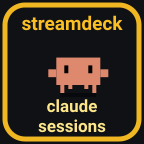
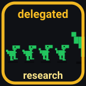
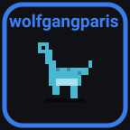
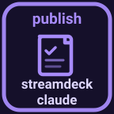
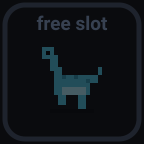

# streamdeck-claude

> A Stream Deck plugin that mirrors live [Claude Code](https://github.com/anthropics/claude-code) and OpenAI Codex CLI session state on as many keys as you assign it.

[](LICENSE)
[](#compatibility)
[](https://nodejs.org)
[](https://www.elgato.com/stream-deck)

Each running `claude` CLI session lights up one key on your deck — project name, current state, animated when it's working, pulsing when it needs you. Press a key to copy the session's `cwd` to your clipboard and, when possible, bring its terminal to the foreground.

## Fork: macOS + Ghostty (eordouie)

This fork targets **macOS + [Ghostty](https://ghostty.org)** and adds, on top
of upstream:

| Addition | What it does |
|---|---|
| **Ghostty tab focus** | A slot press jumps to that session's exact tab. The plugin *assigns* each tab a unique name (written to the session's tty) and matches it exactly — it never guesses. See [`docs/ghostty-focus.md`](docs/ghostty-focus.md). |
| **One word per session** | A single cheap headless call names each session with one distinguishing word, once, after it has real context. The word labels the key *and* the Ghostty tab. |
| **Attention flash** | A key flashes from the moment its session finishes or needs input until you press it (or reply). Static idle doesn't flash. |
| **Per-slot mascots** | Each key position has its own walking, blinking pixel character on idle. |
| **Command keys** | A first-party action that runs a configured script. Currently unused on the author's deck — the command keys were retired in favor of the sibling deck-signals plugin's ambient keys — but the action remains available. |
| **Free slot = new tab** | Press an **empty** slot and you get one fresh Ghostty tab at a bare prompt. It runs no agent: you type `claude`, `codex`, or anything else yourself. The key is held for whatever you start there (2 min), so your session becomes that key's mascot. The launch environment lives in `[launch]` in `dotfiles/streamdeck/layout.toml`. |
| **A key lights up when the agent starts** | ~1 s after you type `claude` or `codex`, not when the agent first writes something. A `ps` scan each tick claims any agent CLI attached to a terminal, so Codex — which announces nothing until you send it a message — still gets its tile immediately. A new session record also wakes the tick on creation instead of waiting out the 1 s poll. |
| **Agent tag on the key** | A Codex session's key shows `codex` on its bottom line; a Claude session shows nothing there — the tag marks the exception, and a bare tile reads as Claude. Model and effort were tried here and removed: on a 72px key they read as noise. |

### Extra setup for this fork

```bash
pnpm install && pnpm build
pnpm sd:link                 # symlink the plugin into the Stream Deck app
pnpm install:hook            # register hooks in ~/.claude/settings.json
pnpm check:hooks             # verify they took
pnpm install:codex-hook      # optional: register the Codex lifecycle bridge
pnpm check:codex-hooks       # optional: verify the Codex registration
# On WSL, for Windows-native Codex:
pnpm install:codex-hook:windows
```

Codex support uses Codex's lifecycle hooks rather than polling its private
session files. The bridge writes a small record and the same event-log format
the plugin already uses for Claude. After `pnpm install:codex-hook`, review and
trust the hook in Codex with `/hooks`, then start a new Codex session. Claude
and Codex sessions can occupy the same deck concurrently.

Then, **required for tab focus to work**, the Claude provider launch spec sets
this automatically. For manually started Claude sessions, make sure this is
in the environment before `claude` starts (put it in your shell rc or
`~/.claude/settings.json`'s `env` block):

```
CLAUDE_CODE_DISABLE_TERMINAL_TITLE=1
```

Claude Code otherwise repaints an animated spinner into each tab title ~10×/s,
which no matcher can race; this hands title control to the plugin. Sessions
started before it is set keep working, but only match after a re-stamp — restart
them to get first-try jumps.

Grant **Stream Deck.app** Accessibility permission (System Settings → Privacy &
Security → Accessibility) on the first key press.

The deck *layout* (which key does what) is intentionally not in this repo — it
lives in the author's dotfiles as a `layout.toml` plus an apply script, so this
fork's diff against upstream stays upstreamable. See the "Fork notes" section of
`CLAUDE.md`.

## State gallery

| | State | Meaning |
|---|---|---|
|  | `working` | Claude is generating / running tools |
|  | `subagent` | Claude has delegated to a subagent (parent waiting) |
|  | `idle` | Claude is waiting for your next prompt |
|  | `awaiting` | Permission prompt — your turn |
|  | `awaiting_plan` | `ExitPlanMode` was called — plan approval pending |
|  | `error` | Last turn failed (rate limit / auth / server error) |
|  | `finished` | Session just ended (visible ~3 s, then drops) |
|  | `empty` | No session in this slot |

## Features

- **Live per-session state** — sessions auto-fill the slots in start-time order; excess sessions beyond the slot count are simply not displayed.
- **Press → copy `cwd`** to clipboard and, when possible, bring the terminal to the foreground:
  - **Warp** — focuses the matching Warp tab (macOS and Windows). See [`docs/warp-focus.md`](docs/warp-focus.md).
  - **VS Code** — raises the VS Code window whose workspace matches the session
    (WSL-remote or native; macOS and Windows). Window-level only — it can't pick
    a specific integrated-terminal tab. See [`docs/vscode-focus.md`](docs/vscode-focus.md).
  If no match is found, the clipboard copy still happens so you can paste the path.
- **Long-press (≥500 ms) → reset that session's state log** — useful if a stuck `awaiting` lingers.
- **Hold 3 s → kill the agent.** The tile goes dark as soon as the signal lands, without the `finished` flash a self-ended session gets: you held the key for three seconds, so the empty slot is the only confirmation worth showing. If the process somehow survives both SIGTERM and SIGKILL, the tile returns after 5 s rather than hiding a live session.
- **Setup key** — wipes all event logs and re-renders every slot in one press. Also self-checks the hook registration: if it's stale or missing (icons would silently break — e.g. a permission padlock that never clears), the key shows an amber **HOOKS** warning. Fix with `pnpm install:hook`, then reload.

## Compatibility

| | Support |
|---|---|
| **Stream Deck app** | macOS 12+, Windows 10+ (Stream Deck app ≥ 6.5) |
| **Agent CLI host** | Claude Code and Codex CLI on macOS, Linux, WSL, Windows-native — sessions on any of these show up |
| **Stream Deck app on Linux** | Not supported — Elgato doesn't ship a Linux app |
| **Node.js** | ≥ 20 (bundled into the plugin runtime by the Stream Deck app) |
| **Terminal integration** | Warp tab focus + VS Code window raise on macOS + Windows; clipboard copy works with any terminal |

## Install

Prereqs everywhere: [pnpm](https://pnpm.io), `jq`, `perl`, Node.js 20+, an Elgato Stream Deck with the SD app installed.

### macOS

```bash
pnpm install
pnpm build
pnpm install:hook        # add hooks to ~/.claude/settings.json
pnpm sd:link             # symlink .sdPlugin into ~/Library/Application Support/com.elgato.StreamDeck/Plugins/
pnpm sd:validate
# Quit + relaunch the Stream Deck app so it picks up the new plugin.
```

For Warp tab focus and VS Code window raise, macOS will prompt to allow Stream Deck under *System Settings → Privacy & Security → Accessibility* on the first key press. Decline and the focus is silently skipped — clipboard copy still works.

### WSL + Windows

Extra prereq: Windows Developer Mode enabled (so `mklink /D` works without admin).

```bash
pnpm install
pnpm sd:dev                   # enable Stream Deck developer mode (one-time)
pnpm build
pnpm install:hook             # WSL ~/.claude/settings.json
pnpm install:hook:windows     # Windows %USERPROFILE%\.claude\settings.json
pnpm sd:link                  # mklink /D into the Windows-side Plugins dir
pnpm sd:validate
```

`WSL_DISTRO_NAME` is auto-detected and baked into the bundle at build time. To target a different distro, set it in your shell before `pnpm build`.

For Warp tab focus on Windows, install `sqlite3` if you don't have it: `winget install SQLite.SQLite`.

After linking, **quit + relaunch the Stream Deck app** (right-click tray icon → Quit). The "Claude Sessions" category appears in the action list.

## Usage

Drag **Claude Session Slot** onto as many keys as you want to dedicate to live sessions. The plugin orders them by deck position (top-to-bottom, left-to-right). Optionally, drag the **Claude Setup** action onto one more key as a maintenance button.

Run `claude` or `codex` in a terminal — the first slot fills with its deck word, amber while working, blue when idle. Open another agent in another `cwd` and slot 2 lights up. Both providers share one slot pool, one word pool, and one tab-title convention; the only visible difference is the word `codex` on a Codex key's bottom line.

Codex sessions additionally require its lifecycle hooks to be **trusted** (`/hooks` inside a Codex session) — they feed the same event log the slots read. Until then a Codex session runs normally but its slot stays empty, which looks identical to the launcher having failed.

## Development

```bash
pnpm watch                    # rebuild + auto-reload the plugin on each change
pnpm sd:reload                # touch the reload trigger to respawn the plugin (~1 s)
```

Logs land at `%APPDATA%\Elgato\StreamDeck\Plugins\com.julien.claudesessions.sdPlugin\logs\` (Windows) or `~/Library/Logs/ElgatoStreamDeck/com.julien.claudesessions.sdPlugin/` (macOS). Full script reference and verification checklist in [`docs/development.md`](docs/development.md).

## Documentation

- [`docs/architecture.md`](docs/architecture.md) — session discovery, hook event → state machine, path/UNC resolution, render pipeline
- [`docs/development.md`](docs/development.md) — full pnpm scripts, end-to-end verification, tweaks
- [`docs/warp-focus.md`](docs/warp-focus.md) — Warp focus internals, per-OS quirks, failure modes
- [`docs/ghostty-focus.md`](docs/ghostty-focus.md) — Ghostty tab focus: owned tab identity, why inference fails, setup + troubleshooting
- [`docs/vscode-focus.md`](docs/vscode-focus.md) — VS Code window focus, matching algorithm, failure modes

## License

Code is MIT — see [`LICENSE`](LICENSE).

The Clawd mascot used in the `idle` state — `com.julien.claudesessions.sdPlugin/assets/clawd/*.svg` and the renderer at `src/icons/motifs.ts::clawdIdleLook` — is derived from [rullerzhou-afk/clawd-on-desk](https://github.com/rullerzhou-afk/clawd-on-desk) and is licensed under **AGPL-3.0**. See [`com.julien.claudesessions.sdPlugin/assets/clawd/NOTICE.md`](com.julien.claudesessions.sdPlugin/assets/clawd/NOTICE.md) for the full attribution.
